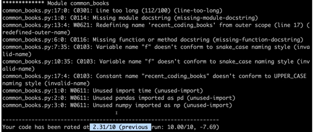

# Coding Best Practices
## 1. Writing Clean
* **Clean code**: Code that is readable, simple, and concise. Clean production-quality code is crucial for collaboration and maintainability in software development.
    * Use meaningful names in variables, functions, classes.
    * Be consistent but clearly differentiate.
    * Avoid abbreviations and specially single letters (exception: counters and common math variables)
    * Long names != descriptive names
* Use whitespace properly. 4 spaces for each indent.
* Limit lines to 79 characters.
---
* **Ruff**: An extremely fast Python linter and formatter, compatible with many popular linting rules (including `pyflakes`, `isort`, and more).
* **Pylint**: A powerful linter that checks for code style issues, logical errors, and can even be extended with custom plugins. `pip install pylint`.
* **Black**: An uncompromising code formatter that automatically formats your Python code to conform to PEP8 (with some strict choices). 
* **PEP8**: `pip install autopep8`

---
This bash command line provides feedback on updates to make to your code to follow PEP8 standards. It will also give you a score out of 10 that can help you understand which improvements are most important.
```bash
pylint script_name.py
```

---
This will attempt to automatically clean up your code.
```bash
autopep8 --in-place --aggressive --aggressive script_name.py
```

## 2. Modular Code
Code that is logically broken up into functions and modules. Modular production-quality code that makes your code more organised, efficient, and reusable.

**Module**: A file. Modules allow code to be reused by encapsulating them into files that can be imported into other files.


## 3. Refactoring Code
Restructuring your code to improve its internal structure without changing its external functionality. This gives you a chance to clean and modularize your program after you've got it working. Pays off by speeding up your development time in the long run.

Importance:
* Reduce repetition by consolidating similar code.
* Improve readability through cleaner, more organised structure.
* Enhance maintanability by centralising logic in one place. 
* Preserve behaviour while improving the underlying implementation.
## 4. Optimising Code
**Efficiency**: Using the resources optimally where resources could be memory, CPU, time, files, connections, databases, etc.

Make code faster and to take up less space in memory/storage.

Example: Use dicts or sets for lookup rather than lists or tuples.
## 5. Writing Documentation
* Inline comments
* Docstrings - module and function level. [Numpy Guideline](https://numpydoc.readthedocs.io/en/latest/format.html). <mark>TODO: Add prompt for docstrings.</mark>
* Project Documentation - project level. Examples:
    - [Scikit-learn](https://github.com/scikit-learn/scikit-learn)
    - [StackOverflow](https://github.com/jjrunner/stackoverflow)
   

### 5.1 README
Good documentation is straightforward, approachable, and easy to understand!

Things to consider:
* Title and Description.
* Installation Instructions and Software Dependencies.
* Common Usage Information.
* Known Bugs.
* Frequently asked questions.
* Table of contents.

<mark>TODO: Add markdown tutorial. Include `<u>` and `<mark>` tags and that files need to be saved in `.md`</mark>


