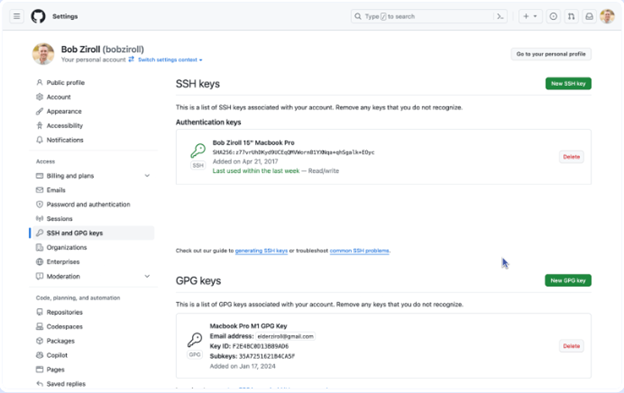
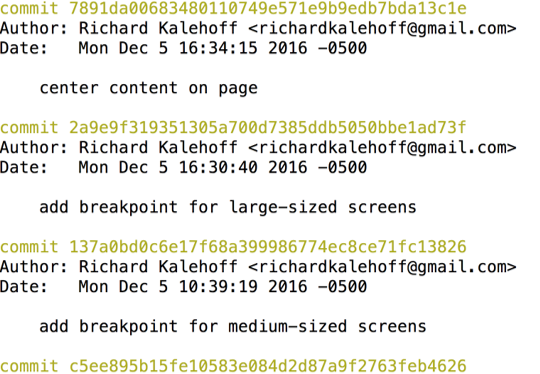
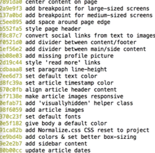
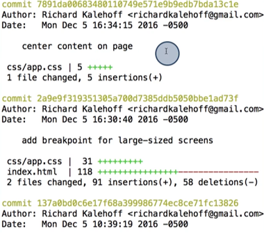
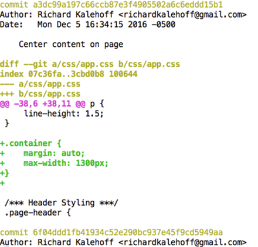
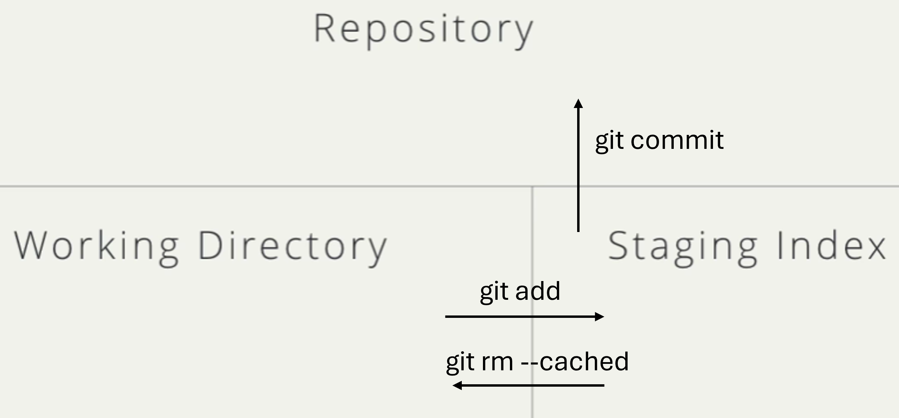
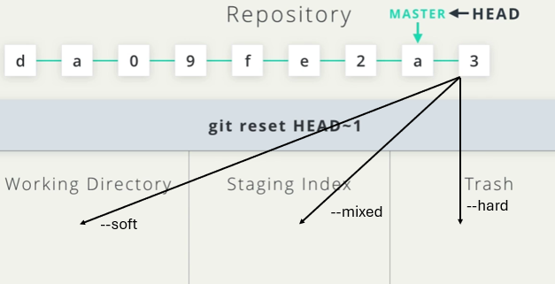

# Git
## Fundamentals
**Public/private keys**
* A method for securely passing data from one place to another. 
* Provides a very high level of confidence that the data is coming from the place it claims to be coming from. 
* SSH key gives us the ability to authenticate with GitHub. [Link](https://docs.github.com/en/authentication/connecting-to-github-with-ssh/adding-a-new-ssh-key-to-your-github-account?tool=webui)
* GPG keys allow us to verify that the commits we’re making to repositories on GitHub are actually coming from us. [Link](https://docs.github.com/en/authentication/managing-commit-signature-verification/adding-a-gpg-key-to-your-github-account)

1. Start the SSH agent:  
   `eval "$(ssh-agent -s)"`
2. Generate a new SSH key:  
   `ssh-keygen -t ed25519 -C "your_email@example.com"`  
   This creates:  
   - `~/.ssh/id_ed25519` (private key — keep secret)  
   - `~/.ssh/id_ed25519.pub` (public key — upload to GitHub)
3. Add your private key to the agent:  
   `ssh-add ~/.ssh/id_ed25519`
4. Copy your public key:  
   `cat ~/.ssh/id_ed25519.pub`
5. Add the key to GitHub:  
   Go to: Settings -> SSH and GPG Keys -> New SSH key  
   Paste the contents of `~/.ssh/id_ed25519.pub`
6. Test the connection:  
   `ssh -T git@github.com`

If you see a success message, SSH is configured correctly.

---

`git config --global core.editor "your-editor"`

Default text editor
* `git config --global core.editor "code --wait"` for Visual Studio code.
* `git config --global core.editor "atom --wait"` for Atom. 

---
`git init`

create a new, empty repository in the current directory. Don't directly edit any files inside the .git directory. This is the heart of the repository. If you change file names and/or file content, git will probably lose track of the files that you're keeping in the repo, and you could lose a lot of work! It's okay to look at those files though, but don't edit or delete them.

---

`git clone` 

Now before you clone anything, make sure you are located in the correct directory on the command line. Cloning a project creates a new directory and places the cloned Git repository in it. The problem is that you can't have nested Git repositories. So make sure the terminal's current working directory isn't located in a Git repository.

`git clone git@github.com:username/fastapi-tutorial.git`

## Review Repo's History
A SHA is basically an ID number for each commit. Here's what a commit's SHA might look like: `e2adf8ae3e2e4ed40add75cc44cf9d0a869afeb6`. It is a 40-character string composed of characters (0-9 and a-f) and calculated based on the contents of a file or directory structure in Git. 'SHA' is shorthand for 'Secure Hash Algorithm'.

`git log`  
Shows a paginated list of commits, including SHA, author, date, and message.  
Navigation inside the log viewer:
- Scroll down: `↓`
- Scroll up: `↑`
- Quit: `q`

Examples:  
1. View full commit history:  
   `git log`  
2. View history starting from a specific commit SHA:  
   `git log --stat <FIRST 7 DIGITS OF HASH>`  
   `git log fdf5493`

---
`git log --oneline`  
Shows one commit per line with a short (7-character) SHA and message.

Examples:  
1. Quick overview of commit history:  
   `git log --oneline`  
2. Compact view starting at a specific commit:  
   `git log --stat <FIRST 7 DIGITS OF HASH>`  
   `git log --oneline 1a2b3c4`

---
`git log --stat`  
Shows which files changed in each commit and how many lines were added or removed.

Examples:  
1. Inspect file-level changes across history:  
   `git log --stat`  
2. Inspect statistics for a particular commit:  
   `git log --stat <FIRST 7 DIGITS OF HASH>`  
   `git log --stat 3fa92bd`

---
`git log -p`  
Displays actual line-by-line changes ('patches') for each commit. Adds file paths, line locations, and diffs to the default output.

Examples:  
1. Review full diffs across recent commits:  
   `git log -p`  
2. View patch details for a specific commit:  
   `git log --stat <FIRST 7 DIGITS OF HASH>`  
   `git log -p a12f890`

---
`git log --decorate`  
Shows additional information such as branch names and tags attached to commits.

Examples:  
1. View history with branch and tag labels:  
   `git log --decorate`  
2. Combine with oneline for a compact labeled view:  
   `git log --oneline --decorate`

---
`git log --oneline --decorate --graph --all`  
Provides a compact, visual representation of all branches.  
- `--graph` adds branching ASCII graphics  
- `--all` includes all branches, not just the current one

Examples:  
1. Visualize the full branching structure:  
   `git log --oneline --decorate --graph --all`  
2. View graph for a specific commit and its ancestry:  
   `git log --stat <FIRST 7 DIGITS OF HASH>`  
   `git log --oneline --decorate --graph --all 4d9ff21`

---
`git show`  
Displays details for one specific commit. Its default output matches `git log -p` (commit info plus patch). Supports common flags:  
- `--stat` for file-change stats  
- `-p` to show patch (default - must re-enable if using `--stat`)  
- `-w` to ignore whitespace changes

Examples:  
1. Show the most recent commit:  
   `git show`  
2. Show a specific commit with whitespace ignored:  
   `git log --stat <FIRST 7 DIGITS OF HASH>`  
   `git show -w e8bc122`

## Managing Git Changes
Git uses a simple workflow:  
1. Modify files in the 'working directory'  
2. Move selected changes to the 'staging area' (`git add`)  
3. Save those staged changes as a 'commit' in the repository (`git commit`)

---
`git status`  
Shows what Git sees: modified files, staged files, and untracked files. The `git status` command displays the state of the working directory and the staging area. It lets you see which changes have been staged, which have not, and which files are not being tracked by Git. Status output does not show any information about the committed project history. Use it frequently, especially when learning Git.

Examples:  
1. Check what changed before adding anything:  
   `git status`

Resource:  
* [Atlassian - Inspecting a Repo](https://www.atlassian.com/git/tutorials/inspecting-a-repository)

---
`git add`  
Moves changes from the working directory into the staging area.

- `git add <filename>` - stage a specific file  
- `git add .` - stage all modified or untracked files

Examples:  
1. Stage a single updated script:  
   `git add train_model.py`

---
`git commit -m '<message>'`  
Takes a snapshot of the staged changes and records them permanently in the repository.  
Good commits represent one logical unit of work, something that could be cleanly removed if the commit were reverted.

Guidelines for Commit Messages:  
- Keep the message short (about under 60 characters).  
- Describe what the commit does, not how or why.  
- Avoid the word 'and' because it often means the commit includes more than one change.  
- A helpful trick: complete the sentence 'This commit will...' and use that phrase as your message.  
- Be consistent with your style.

Examples:  
1. Add a new feature:  
   `git commit -m 'Add login validation for empty email'`  
2. Fix documentation:  
   `git commit -m 'Fix broken link in README'`

Resources:  
* [How to write a git commit](https://chris.beams.io/git-commit)  
* [Udacity Commit Styleguide](https://udacity.github.io/git-styleguide/)

---
`git rm --cached`  
Will not destroy any of your work; it just removes it from the Staging Index.

Examples:  
1. Removes file from index:  
   `git rm --cached config.json` 

---
`git diff`  
Shows line-by-line differences between file versions. Useful for reviewing what has changed but is not yet committed.

It displays:  
- Modified files  
- Where lines were added or removed  
- The actual content differences

Examples:  
1. Review unstaged changes before adding them:  
   `git diff`  
2. Compare staged changes only:  
   `git diff --staged`

More examples:  
* `git diff --staged` - staged changes vs. last commit  
* `git diff HEAD` - working directory vs. last commit  
* `git diff commit1 commit2` - differences between two commits  
* `git diff branch1 branch2` - differences between branches

---
`.gitignore`  
Specifies files and patterns that Git should not track, such as logs, temporary data, build artifacts, or large datasets. Place the `.gitignore` file in the root of your repository (the same level as `.git/`).

Gitignore pattern rules:  
- Blank lines are for spacing  
- `#` marks a comment  
- `*` matches zero or more characters  
- `?` matches exactly one character  
- `[abc]` matches any listed character  
- `**` matches nested directories (for example, `a/**/z` matches `a/z`, `a/b/z`, `a/b/c/z`)

Examples:  
1. Ignore all JPEGs inside a folder:  
   `samples/*.jpg`  
2. Ignore all log files anywhere:  
   `**/*.log`

## Git Tagging, Branching, Checkout, and Merging

**Tagging (`git tag`)**  
Tags mark specific commits - commonly used for releases.  
Use annotated tags (`-a`) because they store the tag author, date, and message, unlike lightweight tags.

- Create annotated tag for latest commit: `git tag -a v1.0 -m 'Release v1.0'`
- List tags: `git tag`
- Delete a tag: `git tag -d v1.0`
- Tag an older commit:  
  `git tag -a v1.0 <FIRST 7 DIGITS OF HASH>`  
  `git tag -a v1.0 3fa92bd`

Examples:  
1. Tag a release commit:  
   - `git tag -a v2.3 -m 'Stable release 2.3'`  
   - `git push origin v2.3`  
2. Tag a previous bug-fix commit:  
   - `git log --oneline`  
   - `git tag -a bugfix-1 <FIRST 7 DIGITS OF HASH> -m 'Bugfix tag'`  
   - `git tag -a bugfix-1 3fa92bd -m 'Bugfix tag'`

---

**Branching (`git branch`)**  
Branches allow parallel lines of development. A branch is when a new line of development is created that diverges from the main line of development. 
- List branches: `git branch`
- Create a branch: `git branch [NAME]`
- Delete a branch: `git branch -d [NAME]`  
  (You cannot delete the branch you are currently on.)

Examples:  
1. Create and push a feature branch:  
   - `git branch [NAME]`  
   - `git push -u origin [NAME]`  
2. Clean up merged branches:  
   - `git branch --merged`  
   - `git branch -d [NAME]`  

Resources:
* [Practice Branching](https://learngitbranching.js.org/)
* [Atlassian - Using Branching](https://www.atlassian.com/git/tutorials/using-branches)
* [Successful Git Branching](https://nvie.com/posts/a-successful-git-branching-model/) 

---

**Checkout (`git checkout`)**  
Used to switch branches or restore the working directory to a specific commit.  
Switching branches replaces tracked files in your working directory with the version from the target branch.

- Switch to branch: `git checkout main`
- Create and switch to a branch: `git checkout -b new-feature`
- Checkout a specific commit (detached HEAD):  
  `git checkout <FIRST 7 DIGITS OF HASH>`  
  `git checkout 3fa92bd`

Examples: 
1. Start work on a new feature quickly:  
   - `git checkout -b analytics-v2`  
   - Begin editing files  
2. Inspect historical code:  
   - `git log --oneline`  
   - `git checkout <FIRST 7 DIGITS OF HASH>`  
   - `git checkout 3fa92bd`

---
**Switch (`git switch`)**  
Switches to an existing branch and updates your working directory. Fails if the branch does not exist.

`git switch <branch>`  
Examples:  
1. Move to the main development branch:  
   - `git switch main`  
   - Continue work on stable code  
2. Review a teammate’s feature branch:  
   - `git switch feature-payment-flow`  
   - Test or review implementation  

`git switch -c <branch>`  
Creates a new branch and switches to it. Same as `git checkout -b <branch>`.

Examples:  
1. Start a new data-cleaning feature:  
   - `git switch -c data-cleaning-tool`  
   - Begin coding isolated changes  
2. Create a branch for experimentation:  
   - `git switch -c try-new-model`  
   - Test model changes without affecting main  

`git switch -C <branch>`  
Force-creates a branch, overwriting any existing branch with the same name. ⚠️ Use with caution.

Examples:  
1. Reset a messy experimental branch:  
   - `git switch -C experiment-reset`  
   - Begin with a clean branch state  
2. Recreate a lost or outdated branch:  
   - `git switch -C stale-branch`  
   - Branch now starts from the current HEAD  
---
**Merging (`git merge`)**  
Merges incorporate changes from one branch into another.

- Basic merge: `git merge feature-branch`
- Prevent fast-forward (forces a merge commit): `git merge --no-ff documentation`

Git performs merges by:  
1. Locating each branch's history  
2. Finding their common ancestor  
3. Combining changes  
4. Creating a merge commit (unless fast-forward is used)

Fast-forward merges occur when the target branch has no divergent commits; Git moves the pointer forward instead of creating a merge commit.

Examples:  
1. Merge a completed feature into main:  
   - `git checkout main`  
   - `git merge feature-analytics`  
2. Force a merge commit for clarity in history:  
   - `git checkout develop`  
   - `git merge --no-ff ui-update`  

Resources:
* [Video](https://www.youtube.com/watch?v=0chZFIZLR_0)
* [Atlassian Using Merge](https://www.atlassian.com/git/tutorials/using-branches/git-merge)

---

**Handling Merge Conflicts**  
A conflict occurs when different branches change the same lines in a file. Git cannot auto-merge and inserts conflict markers into the file.

Conflict indicators in your editor:
- `<<<<<<< HEAD` - shows what is on your current branch  
- `||||||| merged common ancestors` - shows original content before either branch changed it  
- `=======` - separator between original and incoming branch content  
- `>>>>>>> <branch-name>` - shows what is on the branch being merged in

To resolve:

1. Manually choose which content to keep (yours, theirs, or a combination).  
2. Remove all conflict markers (`<<<<<<<`, `|||||||`, `=======`, `>>>>>>>`).  
3. Save the file.  
4. Stage and commit the resolution:  
   - `git add <file>`  
   - `git commit`  

Examples:  
1. Resolve conflict during merge:  
   - `git checkout main`  
   - `git merge feature-x`  
   - Resolve conflict then run `git add` and `git commit`  
2. Resolve multi-file conflicts:  
   - `git status`  
   - Edit each file, remove markers, then run `git add .` and `git commit`

Resource:

* [Github Merge Conflicts](https://docs.github.com/en/pull-requests/collaborating-with-pull-requests/addressing-merge-conflicts/about-merge-conflicts)

## Git Push, Pull, and Pull Requests

**Pushing to a remote repository**  
`git push` uploads your local commits to the remote branch. This does not need to be done after every commit. Push when your work reaches a meaningful checkpoint.

**When to push**  
- Working alone: Push when you finish a feature, a fix, or at the end of the day.  
- Working in a team: Push more frequently so teammates can see your progress and avoid conflicts.

**Setting an upstream branch**  
Use this when pushing a branch to the remote for the first time. After this, you can run `git push` without specifying the remote and branch.

`git push -u origin <branch_name>`  
Examples:  
1. `git push -u origin project_two_branch`  
2. `git push -u origin chap04`

**Pushing to the main branch**  
`git push origin main`  
Examples:  
1. Push local main to remote main: `git push origin main`  
2. Push after merging a feature: `git push origin main`

**Pulling from a remote repository**  
`git pull` downloads the latest changes and merges them into your current branch. Pull often to reduce the chance of conflicts.

`git pull`  
Examples:  
1. Stay updated while working on a feature: `git pull`  
2. Pull changes before starting your day: `git pull`

**Pulling directly from main**  
`git pull origin main`  
Examples:  
1. Update your branch with the newest main: `git pull origin main`  
2. Prepare your branch before creating a pull request: `git pull origin main`

**Pull requests**  
A pull request is a request to merge your branch into another branch. It lets others review and approve your work.

Guidelines:  
- Add a short description of what you changed.  
- Explain why you made those changes.  
- Pull the latest changes before opening your pull request so you avoid conflicts.

Examples:  
1. You completed a feature in `project_01_database` and want to merge it into `main` using a pull request.  
2. You fixed a bug in `chap04` and open a pull request to describe the issue and your fix.

**After pushing to main**  
Once your work is merged and pushed to `main`, you can delete the feature branch to keep the repository clean.

Examples:  
1. After merging `project_two_branch`, delete it locally and remotely.  
2. After merging `chap04`, remove it because the updated work is already in `main`.

## Undoing Changes in Git
`git commit --amend`  
Rewrites the most recent commit. Use it when you forgot to add a file or want to fix the message. If the commit is already pushed, you must run `git push --force`, which can overwrite history on the remote.

Examples:  
1. Add a missing file to the last commit:  
   `git add missing_file.py`  
   `git commit --amend`  
2. Fix the previous commit message:  
   `git commit --amend -m 'Fix typo in message'`

---

`git revert`  
Creates a new commit that reverses the changes made in a specific commit. It does not delete history. If the history is A - B - C and you revert B, you get a new commit after C that negates B, but B remains in the log.

Examples:  
1. Revert a commit by SHA:  
   `git revert 1a2b3c4d`  
2. Revert with a new message:  
   `git revert 1a2b3c4d -m 'Revert faulty update'`

---

`git reset`  
Moves the current branch pointer to a different commit. This can rewrite history, so it is risky. Git keeps unreachable commits for about 30 days, and you can find them using `git reflog`. Alternative you can also create a branch called backup `git branch backup`.

- `git reset --soft` keeps changes staged.  
- `git reset --mixed` (default) keeps changes in the working directory but unstaged.  
- `git reset --hard` discards all changes.

Examples:  
1. Undo the last commit but keep all changes staged:  
   `git reset --soft HEAD~1`  
2. Hard reset to remove the last commit and all associated changes:  
   `git reset --hard HEAD~1`

If the reset commit was already pushed, you may need `git push --force`, but this can cause problems for anyone who already pulled the old history.

Resources:
* [Atlassian - Undoing Changes](https://www.atlassian.com/git/tutorials/undoing-changes)

## Tutorial: Downloading a Small Part of a Repo
Minimal recipe to download only the 'assets' folder from the example repo:

1. `git clone --filter=blob:none --no-checkout https://github.com/PacktPublishing/Building-Data-Science-Applications-with-FastAPI-Second-Edition.git`
   - `clone`: tells Git to copy a remote repository.  
   - `--filter=blob:none`: tells Git to avoid downloading file contents and only fetch metadata until needed (e.g., file names, tree structure, commit history).  
   - `--no-checkout`: tells Git not to write any files to the working directory yet.  
   - `<repo-url>`: the address of the repo you want to clone.
2. `cd Building-Data-Science-Applications-with-FastAPI-Second-Edition`
   - `cd`: change directory.
3. `git sparse-checkout init --cone`
   - `sparse-checkout`: enables a mode that limits which files appear in your working tree.  
   - `init`: sets up sparse-checkout.  
   - `--cone`: uses a simple directory based pattern style.
4. `git sparse-checkout set assets`
   - `sparse-checkout`: the Git feature you are managing.  
   - `set`: defines which paths will be included.  
   - `assets`: the folder you want in your working directory.
5. `git checkout main`
   - `checkout`: updates your working directory to match a branch or commit.  
   - `main`: the branch whose version of the 'assets' folder you want.

This pattern works for any GitHub repo. You just change the repository URL and the folder path you pass to `git sparse-checkout set`.

## Resources
* [Udacity Free Course](https://www.udacity.com/course/version-control-with-git--ud123)
* [Data & Model Versioning](https://wandb.ai/site/articles/intro-to-mlops-data-and-model-versioning/)
* [Data Science Version Control](https://towardsdatascience.com/version-controlling-in-practice-data-ml-model-and-code-e13c518067dc/)
* [Practice Online](https://learngitbranching.js.org/)